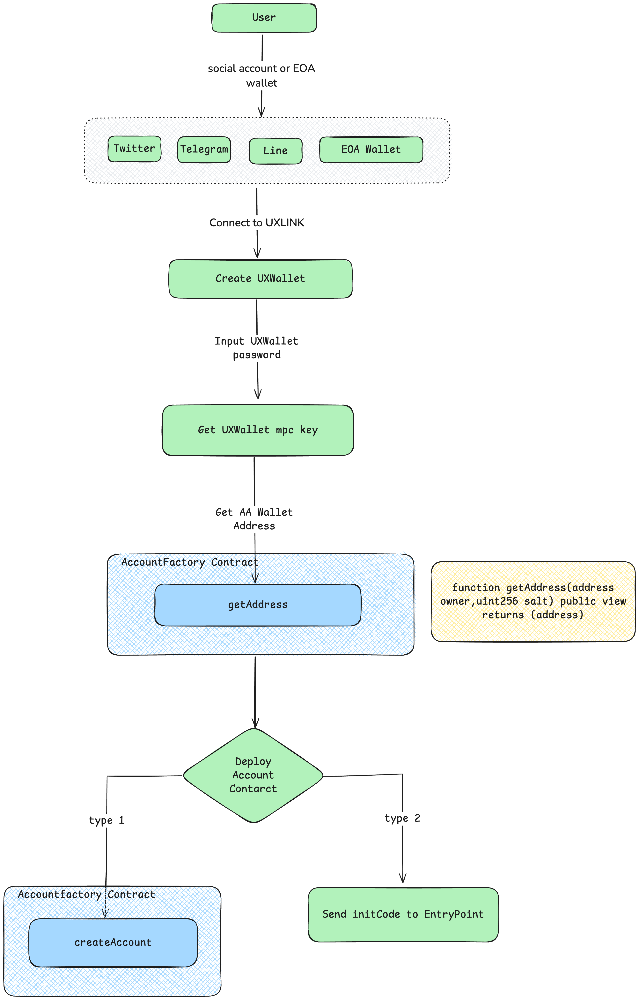

# UXLINK AA Wallet
每一个用户，都拥有一个Account合约，这个合约的地址，就是用户的AA钱包的地址。

账户合约是由一个账户工厂合约（`AccountFactory`）创建的。

账户工厂合约（`AccountFactory`）有个createAccount函数，账户合约就是通过这个方法创建的。



这里给出一个前端获取、部署Account Contract的方法，可做参考：
```ts
import { BigNumber, ethers } from "ethers";

const wallet: ethers.Wallet | null = null;
const factoryContract: ethers.Contract | null = null;
const salt =  "****";
const getOrCreateAccount = async () => {
  if (wallet && factoryContract && salt) {
    const accountAddress = await factoryContract.getAddress(wallet.address, salt);

    const code = await provider.getCode(accountAddress);
    if (code !== '0x') {
      setAaAccountAddress(accountAddress);
      return {
        isNewAccunt: false,
        accountAddress: accountAddress,
      };
    }

    const tx = await factoryContract.createAccount(wallet.address, salt, {
      gasLimit: 500000,
      gasPrice: ethers.utils.parseUnits('10', 'gwei'),
      from: wallet.address,
    });
    const receipt = await tx.wait();
    if (receipt.logs && receipt.logs.length > 0) {
      setAaAccountAddress(receipt.logs[0].address);
      return {
        isNewAccunt: true,
        accountAddress: receipt.logs[0].address,
      };
    } else if (receipt.events && receipt.events.length > 0) {
      setAaAccountAddress(receipt.events[0].address);
      return {
        isNewAccunt: true,
        accountAddress: receipt.events[0].address,
      };
    } 
  }
  return null;
}
```


## Factory合约地址
这里给出[account-abstraction](https://github.com/eth-infinitism/account-abstraction)中SimpleAccountFactory的部署地址：
- AccountFactory 对应于 Entrypoint v0.6 的地址：0x9406Cc6185a346906296840746125a0E44976454
- AccountFactory 对应于 Entrypoint v0.7 的地址：0x91E60e0613810449d098b0b5Ec8b51A0FE8c8985


## Account合约的必要函数

| function name | Description |
| - | - |
| validateUserOp | 验证用户的签名和nonce |
| execute | 执行一笔交易, 执行 `UserOperation` 传递的 callData，通过次函数实现Account 合约与其他合约的交互 |

eth-infinitism提供的合约：[SimpleAccount合约](https://github.com/eth-infinitism/account-abstraction/blob/develop/contracts/samples/SimpleAccount.sol)

eip-4337协议中Account合约说明，可查看：[eip-4337 Account](https://eips.ethereum.org/EIPS/eip-4337#account-contract-interface)

##  AccountFactory的createAccount


- [SimpleAccountFactory合约](https://github.com/eth-infinitism/account-abstraction/blob/develop/contracts/samples/SimpleAccountFactory.sol)

```Solidity 
// SPDX-License-Identifier: GPL-3.0
pragma solidity ^0.8.23;
import "./SimpleAccount.sol";

contract SimpleAccountFactory {
    // ... Other code

    function createAccount(address owner,uint256 salt) public returns (SimpleAccount ret) {
        address addr = getAddress(owner, salt);
        uint256 codeSize = addr.code.length;
        if (codeSize > 0) {
            return SimpleAccount(payable(addr));
        }
        ret = SimpleAccount(payable(new ERC1967Proxy{salt : bytes32(salt)}(
                address(accountImplementation),
                abi.encodeCall(SimpleAccount.initialize, (owner))
            )));
    }

    // ... Other code
}
```

## 通过 initCode 创建

Wallet App内，可通过createAccount直接创建账户合约，不过也不用立刻创建，用户首次提交`UserOperation`，会设置一个参数`initCode`， `Bundler` 把 `UserOperation` 提交给 `EntryPoint`合约后，`EntryPoint`合约发现Account合约还没有部署，就会使用 `initCode`创建Account 合约。


[EntryPoint合约](https://github.com/eth-infinitism/account-abstraction/blob/develop/contracts/core/EntryPoint.sol)

```Solidity
// SPDX-License-Identifier: GPL-3.0
pragma solidity ^0.8.23;

// Other code

import "./SenderCreator.sol";

/// @custom:security-contact https://bounty.ethereum.org
contract EntryPoint is IEntryPoint, StakeManager, NonceManager, ReentrancyGuard, ERC165 {

  // Other code

  SenderCreator private immutable _senderCreator = new SenderCreator();

  // Other code

  function senderCreator() internal view virtual returns (SenderCreator) {
      return _senderCreator;
  }

  /// @inheritdoc IEntryPoint
  function getSenderAddress(bytes calldata initCode) public {
      address sender = senderCreator().createSender(initCode);
      revert SenderAddressResult(sender);
  }

  // Other code

}
```

[SenderCreator 合约](https://github.com/eth-infinitism/account-abstraction/blob/develop/contracts/core/SenderCreator.sol)

```Solidity
// SPDX-License-Identifier: GPL-3.0
pragma solidity ^0.8.23;

contract SenderCreator {
    /**
     * Call the "initCode" factory to create and return the sender account address.
     * @param initCode - The initCode value from a UserOp. contains 20 bytes of factory address,
     *                   followed by calldata.
     * @return sender  - The returned address of the created account, or zero address on failure.
     */
    function createSender(
        bytes calldata initCode
    ) external returns (address sender) {
        address factory = address(bytes20(initCode[0:20]));
        bytes memory initCallData = initCode[20:];
        bool success;
        /* solhint-disable no-inline-assembly */
        assembly ("memory-safe") {
            success := call(
                gas(),
                factory,
                0,
                add(initCallData, 0x20),
                mload(initCallData),
                0,
                32
            )
            sender := mload(0)
        }
        if (!success) {
            sender = address(0);
        }
    }
}
```
