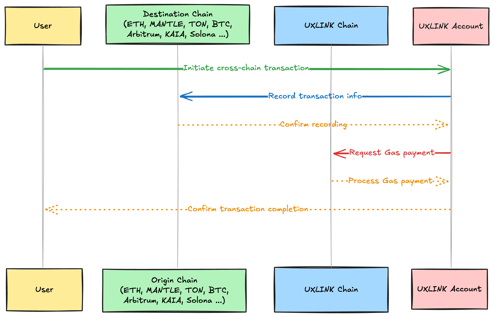

# UXLINK Account: The Foundation of UXLINK Chain for Hassle-Free Cross-Chain Transactions

## Overview

To enhance the user experience in web3, we are committed to enabling more individuals to effortlessly acquire blockchain accounts and simplify the process of initiating cross-chain transactions. This vision is encapsulated in our principle: “One Account, One Gas.” Guided by this philosophy, we have built the public chain UXLINK Chain, on top of which we developed UXLINK Account.

UXLINK Account is an innovative project that allows users to easily create accounts using social media accounts or EOA wallets, providing a fresh approach to digital asset management. With UXLINK Account, users can utilize UXLINK tokens to cover all gas fees for transactions. This functionality significantly streamlines operations on the blockchain and greatly enhances the transaction experience within web3 projects.

Furthermore, UXLINK Account introduces cross-chain capabilities, allowing users to complete cross-chain transactions with just one UXLINK Account and a sufficient balance of UXLINK Tokens. This design philosophy delivers a more efficient and convenient digital asset management experience.

To further optimize user experience, UXLINK Chain employs UXLINK Token as its native currency for efficient gas payments. Additionally, UXLINK Chain integrates cross-chain bridges, ensuring that cross-chain transactions via UXLINK Account are both safe and efficient.

## Cross-Chain Transaction Mechanism

To achieve flexible and efficient cross-chain transactions, UXLINK Account employs an innovative structure that utilizes side-chain accounting along with main-chain gas payments. The basic process for cross-chain transactions is as follows:

1. **Side-Chain Accounting**: Whenever a user initiates a transaction across different chains, the transaction information is recorded on the corresponding side chain. This design alleviates the burden on the main chain, enhancing the overall system's performance and responsiveness.
   
2. **Main-Chain Gas Payments**: When performing cross-chain operations, the required gas fees are handled by the main chain of UXLINK. This approach ensures the transparency and traceability of transactions, relieving users of the need to constantly worry about varying gas fees across different chains, thereby significantly improving operational convenience.

Through these innovative mechanisms, UXLINK Account supports cross-chain sign-in between test chains such as Ethereum Sepolia, Arbitrum Sepolia, and Mantle Sepolia, markedly enhancing user experience.

## UXLINK Chain

As the main chain for UXLINK Account, UXLINK Chain is at the core of our technological innovations. Its architectural design highlights several key features:

1. **High Throughput and Low Latency**: By optimizing the consensus mechanism, UXLINK Chain ensures rapid responsiveness even during high transaction volumes, with delays kept to just a few seconds.
   
2. **Multi-Chain Interoperability**: Utilizing light nodes and cross-chain bridge technology, UXLINK Chain facilitates efficient interactions with other public chains, further expanding the connectivity of our ecosystem.

3. **Security Design**: UXLINK Chain implements a multi-layered security strategy, including smart contract audits and real-time monitoring, ensuring that user assets remain secure.

## UXLINK Account Experience Link
Feel free to explore the UXLINK Account Demo: [https://one-account-demo.uxlink.io/](https://one-account-demo.uxlink.io/)

<video controls src="../../public/video/UXLINK-Account-Cross-Chain.mp4" title="UXLINK Account Cross Chain"></video>

### New User Guide
#### 1. Initialize Your UXLINK Account​
@ See: The Smoothest Web3 Experience: Introducing UXLINK Account (One Account): https://blog.uxlink.io/the-smoothest-web3-experience-introducing-uxlink-account-one-account-8fbbfaf65405

#### 2. Initiate a Transfer Transaction and Pay Gas with UXLINK​
After account initialization, you can initiate a transfer transaction.

Click the “Send” button, enter the recipient’s address and the transfer amount.

After confirming the information is correct, click the “Continue” button. The system will automatically calculate the required gas fee, which will be paid using your UXLINK tokens.

Then, enter your password to confirm submission. You can view the transaction record under the “Activity” tab.

#### 3. Interact with the Dapp — Use UXLINK to Check In and Pay Gas Fees, Supporting Cross-chain Check In

Switch to the “Tasks” tab.

By default, Ethereum Sepolia testnet is selected. You can choose from Ethereum Sepolia, Arbitrum Sepolia, and Mantle Sepolia among the test networks (we will continue to add cross-chain support for other networks).

Click the "Check In" button, and in the pop-up window, enter your password to confirm. It's simple and easy.

### Conclusion

The design and implementation of UXLINK Account and UXLINK Chain represent not only a technological breakthrough but also a profound understanding of user experience. In this user-centric digital asset management domain, we are dedicated to creating a more convenient and efficient environment, enabling blockchain technology to truly integrate into the daily lives of every user. Through continuous innovation, we believe UXLINK will bring forth more possibilities and excitement to the future of the Web3 world.