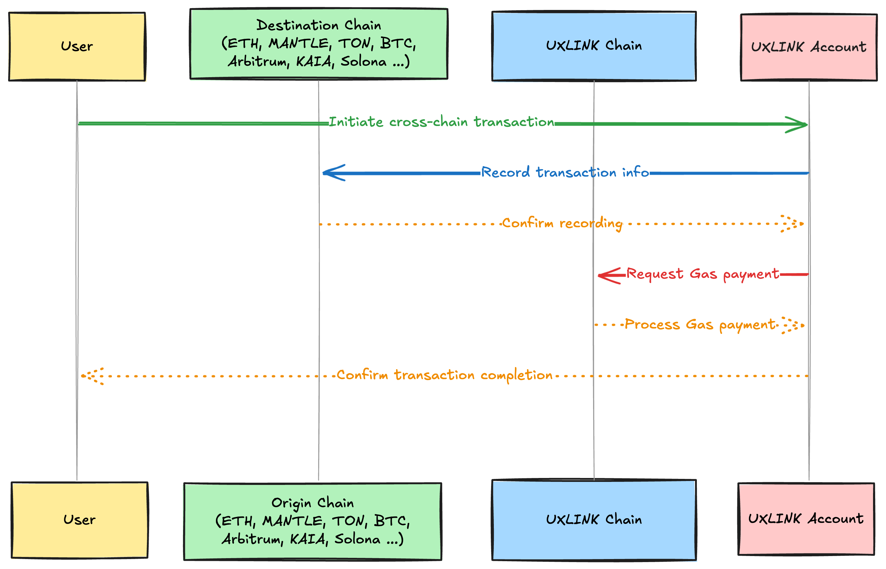

# UXLINK Account：以 UXLINK Chain 为基石，让跨链交易轻松无忧

## 项目概述

为提升web3的用户体验，我们致力于让更多人轻松拥有区块链账号，并简化跨链交易的发起过程，因此提出了 “One Account, One Gas” 的理念。在这一理念的指引下，我们构建了公链 UXLINK Chain，并在其基础上开发了 UXLINK Account。

UXLINK Account 是一项创新项目，允许用户通过社交账号或EOA钱包轻松创建个人账户，提供全新的数字资产管理方式。借助 UXLINK Account，用户可以使用 UXLINK 代币支付所有交易的 gas 费用，从而显著简化在区块链上的操作流程，并大幅提升在web3项目中的交易体验。

此外，UXLINK Account 还实现了跨链功能，用户只需一个 UXLINK Account 和足够的 UXLINK Token 余额，即可顺利完成跨链交易。这一设计理念为用户提供了更高效、便捷的数字资产管理体验。

为了进一步优化用户体验，UXLINK Chain 采用 UXLINK Token 作为原生代币，使Gas支付更加高效。同时，UXLINK Chain 集成了跨链桥，确保 UXLINK Account 的跨链交易更加安全且高效。

## 跨链交易的机制

为了实现灵活高效的跨链交易，UXLINK Account采用了副链记账与主链支付Gas的创新架构。这一跨链交易的基本流程如下：

1. **副链记账**：每当用户在不同的链上发起交易时，交易信息会被记录在相应的副链上。这种设计不仅减轻了主链的负担，还提升了整个系统的性能和响应速度。
2. **主链Gas支付**：用户在进行跨链操作时，所需的Gas费用由UXLINK Chain主链处理。这一做法确保了交易的透明性和可追溯性，同时用户无需额外担心各个链的Gas费变化，极大地提升了操作的便利性。

通过以上创新机制，UXLINK Account能够支持在Ethereum Sepolia、Arbitrum Sepolia和Mantle Sepolia等测试链之间的跨链签到，用户体验显著提升。

## UXLINK Chain的技术框架

UXLINK Chain作为UXLINK Account的主链，是我们技术创新的核心。其架构设计包含以下亮点：

1. **高吞吐量与低延迟**：通过优化共识机制，UXLINK Chain确保了即使在高交易量情况下，系统依然能够快速响应，处理延迟仅在数秒之内。
2. **多链互操作性**：利用轻节点和跨链桥技术，UXLINK Chain能够与其他公链实现高效互通，进一步扩展了生态系统的连接性。
3. **安全性设计**：UXLINK Chain采用了多层次的安全防护策略，包括智能合约审计和实时监控，确保用户资产的安全性不受威胁。

## UXLINK Account Demo 体验地址
欢迎访问 UXLINK Account Demo 项目链接：https://one-account-demo.uxlink.io/

<video controls src="../../public/video/UXLINK-Account-Cross-Chain.mp4" title="UXLINK Account Cross Chain"></video>

### 新用户操作指引
#### 1. 账户登录
一旦打开体验链接，您将直接进入登录界面。

您可以选择使用社交账号或外部拥有账户（EOA）钱包登录，并按照提示完成登录流程。

#### 2. 充值 UXLINK 代币
成功登录后，您需要充值 UXLINK 代币以方便后续操作。

点击“领取 UXLINK”按钮，获得 100 个 UXLINK 代币。

领取成功后，您的账户将显示相应的 UXLINK 余额。

#### 3. 初始化账户
充值完成后，点击“初始化账户”按钮，完成账户初始化。

点击按钮后，会弹出一个页面显示估计的 Gas 费用，单位为 UXLINK。

输入密码完成初始化。

#### 4. 发起转账交易
账户初始化后，您可以发起转账交易。

点击“发送”按钮，输入接收方地址和转账金额。

确认信息无误后，点击“继续”按钮，系统将自动计算所需的 gas 费用，并使用您的 UXLINK 代币支付。

接着，输入密码确认提交。您可以在“Activity”标签下查看交易记录。

#### 5. 跨链签到
切换至“Tasks”标签。

默认选定以太坊 Sepolia 测试链，点击下拉框中，可以选择Ethereum Sepolia、Arbitrum Sepolia、Mantle Sepolia这三个测试链（其他的链我们会持续添加跨链支持）。

点击“Check In”按钮，在弹出窗口中输入密码确认即可，简单易行。

### 结语

UXLINK Account和UXLINK Chain的设计与实现，不仅是技术上的突破，更是对用户体验的深刻理解。在这个以用户为中心的数字资产管理领域，我们致力于营造更为便捷、高效的使用环境，让区块链技术真正走入每个用户的日常生活中。通过不断创新，我们相信UXLINK将为未来的Web3世界带来更多的可能性与惊喜。