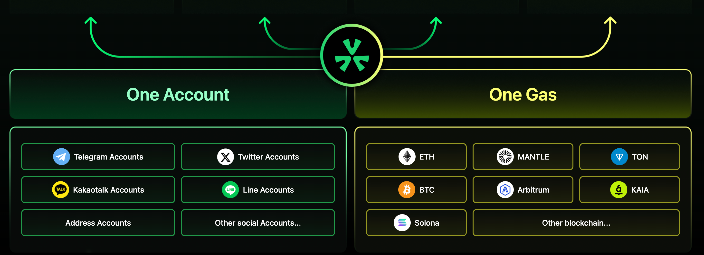

# UXLINK's Account Abstraction: A More Convenient Web3 Wallet

In the rapidly evolving world of blockchain and decentralized applications, user experience is crucial. UXLINK simplifies wallet creation and enhances user experience through Account Abstraction (AA) technology, making account management and gas payments more convenient.

## Why Build an AA Wallet?

In traditional blockchain systems, externally owned accounts (EOA) are the primary way users interact with the blockchain. However, EOA wallets have several drawbacks:

- **Complex User Experience**: Users need to manage private keys, and any mishandling can lead to asset loss.
- **High Gas Fee Barrier**: Users must hold specific tokens like ETH to pay transaction fees.
- **Lack of Flexibility**: EOA wallets have limited functionality, making it difficult to implement complex permission management and automated operations.

## The Rise of AA Wallets

Account Abstraction (AA) technology emerged to address the shortcomings of EOA wallets. Throughout its development, AA wallets have demonstrated several advantages:

- **Enhanced Security**: Accounts are managed through smart contracts, reducing the risk of private key leakage.
- **Flexible Fee Payment**: Allows the use of any token to pay gas fees, improving user convenience.
- **Rich Functional Extensions**: Supports complex permission management and automated transactions, enhancing user experience and efficiency.

## How UXLINK Implements AA Wallets

The traditional Web3 wallet creation process is cumbersome, especially when acquiring ETH for gas fees. UXLINK solves this problem by allowing users to easily create wallets. Users can log into our DApp using an EOA wallet or social accounts (such as Twitter, Telegram, Line, etc.). After logging in, the system automatically generates a Multi-Party Computation (MPC) wallet, known as UXWallet.

### Introducing UXWallet and AA Wallets

UXWallet serves as the foundation for creating an account abstraction wallet, essentially a smart contract account. This innovative approach simplifies wallet management complexity, making it accessible even to users unfamiliar with blockchain technology.

### Paying Gas Fees with UXLINK Tokens

A highlight of UXLINK's AA technology is that users can pay gas fees using UXLINK tokens through our Paymaster contract. This eliminates the need for token swaps or purchasing ETH, streamlining the transaction process.

### Seamless Cross-Chain Interaction

In the decentralized world, cross-chain interactions often require users to spend significant time and effort exchanging tokens and managing assets across different blockchains. UXLINK provides seamless cross-chain support, allowing users to interact across multiple chains without manual exchanges, making the experience truly seamless.

### Architecture Design

1. **User Authentication**: Users can log into the DApp using an EOA wallet or social accounts, ensuring flexibility in access methods.

2. **MPC Wallet Creation**: After logging in, the system creates a UXWallet for the user, utilizing MPC technology to enhance security and usability.

3. **AA Wallet Deployment**: Based on UXWallet, an account abstraction wallet is deployed, encapsulating the user's assets and interactions within a smart contract.

4. **Gas Fee Management**: Through the UXLINK Paymaster contract, users can pay gas fees with UXLINK tokens, simplifying the transaction process.

5. **Cross-Chain Capability**: Users can seamlessly conduct transactions across different blockchains without manually managing assets on each chain.

### Conclusion

UXLINK's account abstraction technology not only addresses the drawbacks of traditional EOA wallets but also offers users a safer and more convenient Web3 experience through innovative features and design. We are paving the way for a more inclusive and accessible decentralized financial ecosystem. Join us and experience the future with UXLINK.
