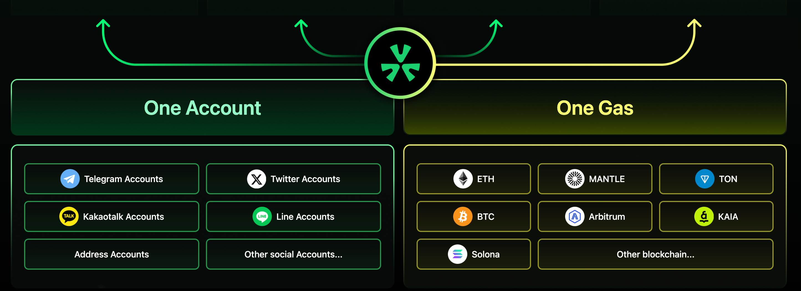

# UXLINK的账户抽象：更加便捷的Web3钱包

在快速发展的区块链和去中心化应用领域，用户体验至关重要。UXLINK通过账户抽象（Account Abstraction）技术，简化了钱包创建流程，并提升了用户体验，使得账户管理和Gas支付更加便捷。

## 为什么要构建AA钱包？

在传统的区块链系统中，外部拥有账户（EOA）是用户与区块链交互的主要方式。然而，EOA钱包存在一些明显的弊端：

- **复杂的用户体验**：用户需要管理私钥，稍有不慎就可能导致资产丢失。
- **高门槛的Gas费支付**：用户必须持有ETH等特定代币来支付交易费用。
- **缺乏灵活性**：EOA钱包的功能受限，无法轻松实现复杂的权限管理和自动化操作。

## AA钱包的兴起

账户抽象（AA）技术应运而生，旨在解决EOA钱包的诸多不足。AA钱包的发展历程中，逐步展现出以下优点：

- **增强的安全性**：通过智能合约管理账户，降低私钥泄露的风险。
- **灵活的费用支付**：允许使用任意代币支付Gas费，提高了用户的便利性。
- **丰富的功能扩展**：支持复杂的权限管理和自动化交易，提升了用户体验和效率。

## UXLINK如何实现AA钱包
传统的Web3钱包创建过程繁琐，尤其是需要获取ETH来支付Gas费。UXLINK解决了这一问题，让用户可以轻松创建钱包。用户可以通过EOA钱包或社交账号（如Twitter、Telegram、Line等）登录我们的DApp。登录后，系统会自动为用户生成一个多方计算（MPC）钱包，即UXWallet。

### 引入UXWallet和AA钱包

UXWallet是创建账户抽象钱包的基础，这实际上是一个智能合约账户。这种创新方法简化了钱包管理的复杂性，使不熟悉区块链技术的用户也能轻松使用。

### 使用UXLINK代币支付Gas费

UXLINK AA技术的一大亮点是通过我们的Paymaster合约，用户可以使用UXLINK代币支付Gas费。这消除了用户需要进行代币交换或购买ETH的麻烦，简化了交易流程。

### 无缝的跨链交互

在去中心化世界中，跨链交互通常需要用户花费大量时间和精力来交换代币和管理不同区块链上的资产。UXLINK提供无缝的跨链支持。这意味着用户可以在多个链之间进行交互，而无需手动交换，使体验真正无感。

### 架构设计

1. **用户认证**：用户可以使用EOA钱包或社交账号登录DApp，这种灵活性确保用户可以选择他们偏好的访问方式。

2. **MPC钱包创建**：登录后，系统会为用户创建一个UXWallet，利用MPC技术提升安全性和可用性。

3. **AA钱包部署**：基于UXWallet，部署一个账户抽象钱包，将用户的资产和交互封装在智能合约中。

4. **Gas费管理**：通过UXLINK Paymaster合约，用户可以使用UXLINK代币支付Gas费，简化交易流程。

5. **跨链能力**：用户可以无缝地在不同区块链上进行交易，而无需手动管理每个链上的资产。

### 结论

UXLINK的账户抽象技术不仅解决了传统EOA钱包的弊端，还通过创新的功能和设计，为用户提供了一种更安全、更便捷的Web3体验。我们正在为一个更具包容性和可访问性的去中心化金融生态系统铺平道路。加入我们，体验UXLINK带来的未来。

